# Minimal Portfolio - Next.js + Supabase

## 🔗 빠른 링크
- 📑 기획서(피그마 슬라이드): https://www.figma.com/file/XXXX
- 🎨 디자인 원본(피그마): https://www.figma.com/file/YYYY

## 1. 프로젝트 개요

### 1.1 목표

- **개인 작업물 전시**: 프론트엔드 과정 수료 후 제작한 프로젝트와 포트폴리오를 한 곳에 모아 소개
- **실서비스형 구현**: Next.js App Router와 Supabase를 활용한 인증, 데이터 관리, 파일 업로드 기능 포함
- **관리 효율성**: 관리자 로그인 후 포트폴리오 항목 CRUD가 가능하도록 구성
- **배포 경험**: Vercel을 통한 프로덕션 배포 및 CI/CD 경험

### 1.2 👥 팀원

| 이름 | 역할 | 주요 담당 | GitHub | 연락 |
| --- | --- | --- | --- | --- |
| 김동주 | 팀장 · FE 리드 | 아키텍처/폴더링<br>CI/CD(Vercel·Actions)<br>Supabase 스키마·RLS 정책<br>성능 최적화·코드리뷰 | [@alikerock](https://github.com/alikerock) | (예) dj.kim@example.com |
| 이가람 | FE · 제품기능 | 포트폴리오 목록/상세<br>검색·필터·페이지네이션<br>React Query/SWR 상태관리<br>접근성 개선(a11y) | [@garam-dev](https://github.com/garam-dev) | garam@example.com |
| 박지우 | FE · UI/디자인 | Figma 디자인 시스템<br>반응형 레이아웃·컴포넌트<br>이미지 업로드/최적화<br>OG/SEO 메타 | [@jiwoo-park](https://github.com/jiwoo-park) | jiwoo@example.com |

### 1.3 🗓️ 마일스톤

#### 1주차 — 기획/설계
- [ ] 요구사항·화면흐름 정의(Figma 슬라이드)
- [ ] 데이터 모델/테이블·RLS 설계
- [ ] 기본 라우팅/레이아웃/테마 결정

#### 2주차 — 핵심 기능
- [ ] 프로젝트 목록/상세 페이지
- [ ] 이미지 업로드(Storage) + 썸네일
- [ ] 관리자 로그인(Auth) + CRUD(등록/수정/삭제)

#### 3주차 — 품질/운영
- [ ] SEO/OG 태그 + sitemap/robots
- [ ] 성능 최적화(next/image, 코드 스플리팅)
- [ ] 접근성 점검(키보드 포커스/명도 대비)

#### 4주차 — 테스트/배포/문서
- [ ] E2E 5케이스(Cypress/Playwright)
- [ ] GitHub Actions: 테스트 → 프리뷰 → 배포
- [ ] README/시연자료(스크린샷·GIF) 정리

```mermaid
gantt
    title Milestones (예시)
    dateFormat  YYYY-MM-DD
    excludes    weekends

    section 기획/설계
    요구사항·IA 정리           :a1, 2025-08-18, 3d
    Figma 와이어·디자인        :a2, after a1, 3d

    section 구현(핵심)
    Supabase 스키마·RLS        :b1, 2025-08-25, 3d
    목록/상세·업로드           :b2, after b1, 6d
    관리자 Auth + CRUD         :b3, after b2, 4d

    section 품질
    SEO/OG·성능·접근성         :c1, 2025-09-07, 3d
    테스트(E2E)·에러관측       :c2, after c1, 3d

    section 릴리스
    CI/CD 구성·문서화·시연자료 :d1, 2025-09-12, 2d
```



### 1.5 주요 기능

#### 👤 사용자/관리자 관리
- Supabase Auth를 이용한 이메일 기반 로그인
- 관리자 계정만 프로젝트 등록/수정/삭제 가능
- RLS(Row Level Security) 정책 적용

#### 📂 프로젝트 관리
- 프로젝트 등록(제목, 설명, 대표 이미지, 상세 이미지, URL, 리뷰 등)
- 이미지 업로드(Supabase Storage)
- 목록/상세 페이지 구현
- 썸네일과 상세 이미지 구분 저장

#### 🔍 부가 기능
- 검색/필터(기술스택, 카테고리 등)
- 페이지네이션 또는 무한 스크롤
- 반응형 레이아웃(모바일·태블릿·데스크톱 대응)
- SEO 및 OG 태그 자동 생성

---

## 2. 개발 환경 및 배포

### 2.1 개발 스택

#### Frontend
- **Framework**: Next.js 15.x (App Router)
- **Language**: JavaScript / TypeScript
- **Styling**: CSS Modules / Tailwind CSS
- **Routing**: Next.js 라우팅(App Router)
- **Image Handling**: next/image
- **State Management**: useState, useEffect, SWR 또는 React Query 선택 가능

#### Backend (BaaS)
- **Database**: Supabase(PostgreSQL)
- **Auth**: Supabase Auth
- **Storage**: Supabase Storage
- **Edge Functions**: 이미지 처리, 폼 제출, 외부 API 프록시

#### Tools
- **Version Control**: Git & GitHub
- **Deployment**: Vercel
- **CI/CD**: GitHub Actions (테스트 및 배포 자동화)
- **Design**: Figma

### 2.2 배포 URL
- **Production**: https://portfolio-nextjs-supabase-tau.vercel.app/

---

## 3. 라우팅 구조

| 경로                 | 설명                      | 접근 권한 |
|----------------------|---------------------------|-----------|
| `/`                  | 메인 홈(프로젝트 목록)     | 전체      |
| `/portfolio`         | 포트폴리오 전체 보기       | 전체      |
| `/portfolio/[id]`    | 프로젝트 상세 페이지       | 전체      |
| `/about`             | 자기소개 페이지           | 전체      |
| `/contact`           | 연락 페이지               | 전체      |
| `/admin/login`       | 관리자 로그인 페이지       | 비로그인  |
| `/admin/dashboard`   | 프로젝트 목록/관리 대시보드| 관리자    |
| `/admin/insert`      | 프로젝트 등록              | 관리자    |
| `/admin/edit/[id]`   | 프로젝트 수정              | 관리자    |

---

## 4. 데이터 흐름

```mermaid
sequenceDiagram
    actor Admin as 관리자
    participant FE as Next.js Frontend
    participant SB as Supabase

    Admin->>+FE: 로그인 정보 입력
    FE->>+SB: Auth 요청
    SB-->>FE: 토큰 + 사용자 정보
    FE->>FE: 쿠키/상태 저장
    Admin->>+FE: 새 프로젝트 등록 요청
    FE->>+SB: DB Insert + 이미지 업로드(Storage)
    SB-->>FE: 성공 응답
    FE->>Admin: 목록 페이지로 리다이렉트
```



## 5. 프로젝트 구조
```
portfolio-nextjs_supabase/
├─ public/
├─ src/
│  ├─ app/                    # Next.js App Router
│  │  ├─ layout.(js|tsx)
│  │  ├─ page.(js|tsx)
│  │  └─ ...                  # route segments
│  ├─ components/             # 재사용 컴포넌트
│  ├─ lib/                    # Supabase 클라이언트 등
│  │  └─ supabase/client.(js|ts)
│  ├─ styles/                 # 전역/모듈 스타일
│  └─ utils/                  # 유틸 함수
├─ .env.example               # 환경변수 예시
├─ next.config.mjs
├─ package.json
└─ README.md
```


## 6. 아키텍처

```mermaid
%% ===== Extended Flowchart Template for README =====
%% 사용법: 노드 ID(좌측 토큰)는 고유하게 유지하고, 대괄호/괄호 안 라벨만 바꿔 쓰면 됩니다.
flowchart TD

%% 1) 노드 모양 레전드(선택 사항)
subgraph Legend[Legend: Node Shapes]
  direction LR
  L1[Process / Rect]:::muted
  L2(Rounded):::muted
  L3{Decision}:::muted
  L4((Circle)):::muted
  L5[[Subroutine]]:::muted
  L6[/I/O Parallelogram/]:::muted
  L7[(Database)]:::muted
end

%% 2) 레이어(서브그래프)
subgraph Client[Client / Frontend]
  direction TB
  C0([Start]):::start
  C1[Show Login Form]
  C2[/User Inputs Email & Password/]
  C3(Run Client Validation)
  C4{Valid?}
  C5[Show Validation Errors]
  C6[Render Dashboard]
end

subgraph Edge[Edge Functions / API Gateway]
  direction TB
  E1[[Auth Service]]:::accent
  E2[[Project Service]]:::accent
end

subgraph Backend[Supabase / DB / Storage]
  direction TB
  B1[(PostgreSQL DB)]:::db
  B2[(Storage Bucket)]:::db
end

%% 3) 기본 흐름(엣지)
C0 --> C1 --> C2 --> C3 --> C4
C4 -- Yes --> E1
C4 -- No  --> C5

%% Auth 흐름
E1 -->|Verify credentials| B1
B1 -->|Token & Profile| E1
E1 -->|Issue session| C6

%% CRUD 흐름
C6 -->|Create Project| E2
E2 -->|INSERT row| B1
C6 -.->|Upload image| B2
E2 -->|OK / New ID| C6

%% 4) 링크 스타일(필요시)
%% linkStyle <index> stroke:#색상,stroke-width:2px,stroke-dasharray:5 3
%% (index는 위에서 선언된 엣지 순서 기준)
%% 예: linkStyle 2 stroke:#ef4444,stroke-width:2px,stroke-dasharray:5 3

%% 5) 노드 클래스 스타일
classDef start fill:#e0f2fe,stroke:#0284c7,color:#075985;
classDef db fill:#fef9c3,stroke:#f59e0b,color:#92400e;
classDef accent fill:#e9d5ff,stroke:#7c3aed,color:#4c1d95;
classDef muted fill:#f1f5f9,stroke:#94a3b8,color:#475569;

%% 핵심 경로 강조(원하는 노드에 클래스 적용)
class C4,E1,B1,C6 accent

%% 개별 노드 스타일(특정 노드만 별도 강조)
style C5 fill:#fee2e2,stroke:#ef4444,color:#7f1d1d

```


## 7. 향후 개선 사항
 - 프로젝트 검색/필터링 UI
 - 이미지 업로드 시 썸네일 자동 생성
 - Contact 폼 → Edge Function 메일 발송
 - E2E 테스트(Cypress) 및 배포 자동화
 - Lighthouse 성능/SEO 90점 이상 달성

## 8. 실행 방법
### 1. 클론
```
git clone https://github.com/alikerock/portfolio-nextjs_supabase.git
cd portfolio-nextjs_supabase
```

### 2. 패키지 설치
npm install

### 3. 환경변수 설정
cp .env.example .env.local
### Supabase URL, ANON KEY, Storage 버킷명 등 입력

### 4. 로컬 실행
npm run dev

### 5. 프로덕션 빌드
npm run build
npm start

## 9. 테스트 계정
```
https://portfolio-nextjs-supabase-tau.vercel.app/insert
Email: admin@example.com
Password: admin123
```

## 10. 제작 후기
이 프로젝트를 통해 Next.js App Router와 Supabase를 결합하여
전체 CRUD 흐름과 배포까지 경험하였으며,
실무에 가까운 BaaS 활용법, 권한 제어, 성능 최적화 과정을 학습하였습니다.

## 11. 기획/디자인 문서
- **기획서(피그마 슬라이드)**: 사용자 여정, 화면 흐름, 요구사항, 마일스톤 정리  
  링크: https://www.figma.com/file/XXXX
- **디자인 원본(피그마)**: 컴포넌트, 컬러/타이포 스케일, 반응형 레이아웃, 아이콘  
  링크: https://www.figma.com/file/YYYY

### 11.1 미리보기
<!-- /public/readme/ 폴더에 썸네일 PNG를 넣고 경로를 맞춘다 -->
[](https://www.figma.com/file/XXXX "피그마 슬라이드로 이동")
[](https://www.figma.com/file/YYYY "피그마 디자인으로 이동")

### 11.2 버전 메모
- v1.0(2025-08-12): 핵심 화면/플로우 확정
- v1.1(2025-08-15): 모바일 브레이크포인트/컴포넌트 토큰 보강